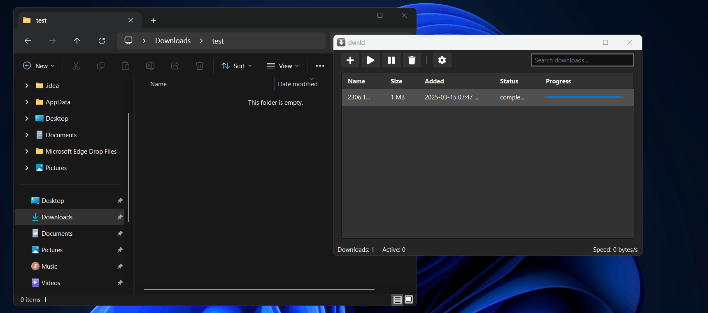

# dwnld

**dwnld** is a cross-platform download manager built with Java, using **OkHttp** for efficient network requests and **JavaFX with JMetro** for a modern UI. It aims to be a lightweight yet powerful alternative to IDM, offering seamless and reliable downloads across Windows, macOS, and Linux.



## Features 

- Multi-threaded downloads for faster speeds
- Modern dark-themed UI with JMetro
- Download history and progress tracking
- Pause and resume functionality
- Parallel downloads with queue support
- Cross-platform support (Windows, macOS, Linux)

## Planned Features

- Support for downloading from streaming sites
- Deeplink integration  
- Scheduler for automated downloads
- Improve Performance

## Contributing
If you find a bug or have suggestions for improvement, feel free to open an issue or submit a pull request on GitHub.

### How to Contribute
1. **Fork the Repository**: Start by forking the project on GitHub.
2. **Clone the Repository**: Clone it to your local machine using:
   ```sh
   git clone https://github.com//your-username/dwnld.git
   ```
3. **Create a Branch**: Create a new branch for your changes:
   ```sh
   git checkout -b feature-branch-name
   ```
4. **Make Changes**: Implement your improvements or bug fixes.
5. **Commit Your Changes**: Write a clear commit message:
   ```sh
   git commit -m "Added feature XYZ"
   ```
6. **Push to GitHub**: Push your changes:
   ```sh
   git push origin feature-branch-name
   ```
7. **Submit a Pull Request**: Open a PR describing your changes.
8. **Review & Merge**: Wait for review and approval before merging.

## License
This project is licensed under the MIT License. See [LICENSE](LICENSE) for details.

## Contact
- **Author**: [Adhishtanaka](https://github.com/Adhishtanaka)
- **Email**: kulasoooriyaa@gmail.com

